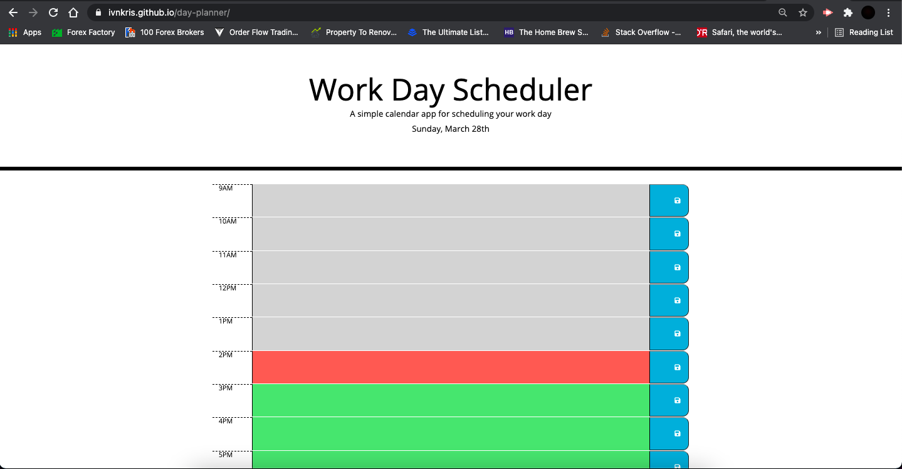
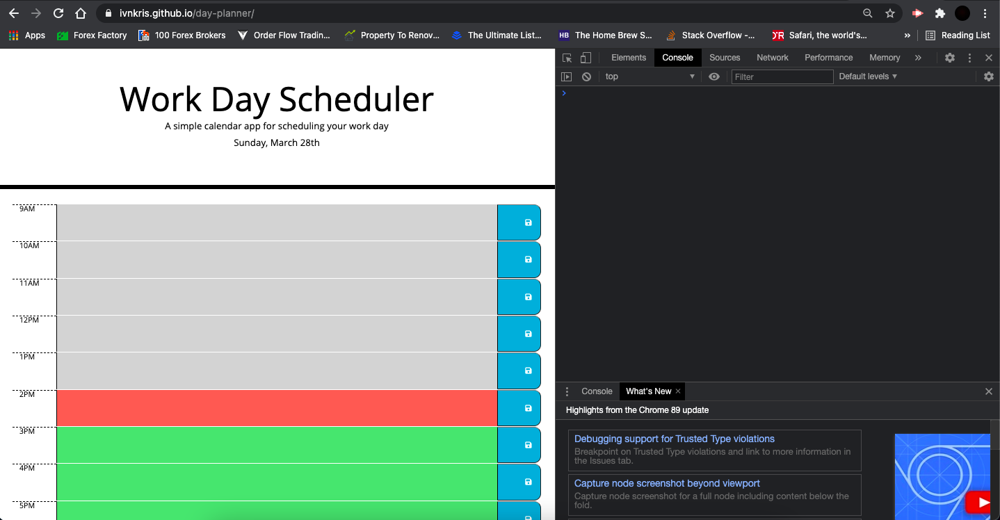
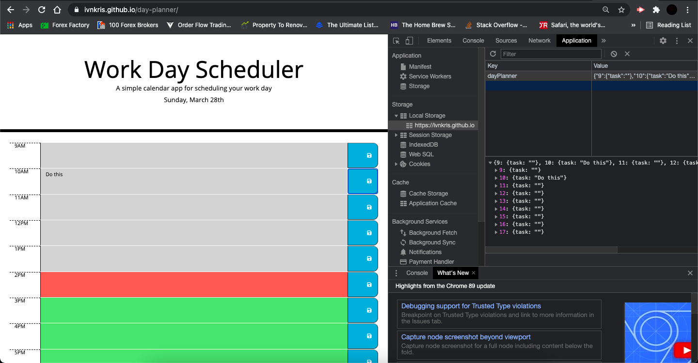

# Day Planner

## Description

In this project I have created a day planner application where on load the current date is automatically displayed in the header and each hour of the working day is colour coded based on the current time to show what's in the past, present and future. The user can input tasks into the textarea and upon pressing the save button these are stored into the local storage and when reloading the page the user is able to retrieve these.

## What I have done

- [x] Added relevant CSS classes to the HTML file to render the page meeting the mock-up design
- [x] Created a function to print the current date into the header on page load
- [x] Created a function to set the textarea colours based on the time of the day
- [x] Added an interval to check the time every 10 seconds and reset the text area colours if needed
- [x] Created a function to initialize the local memory if empty and retrieve saved items and print these into the relevant textareas if not
- [x] Created a function to save the content of teh relevant textarea on pressing of the save button

## Link to Github repository

https://github.com/ivnkris/day-planner

## Link to deployed application

https://ivnkris.github.io/day-planner/

## Screenshots

